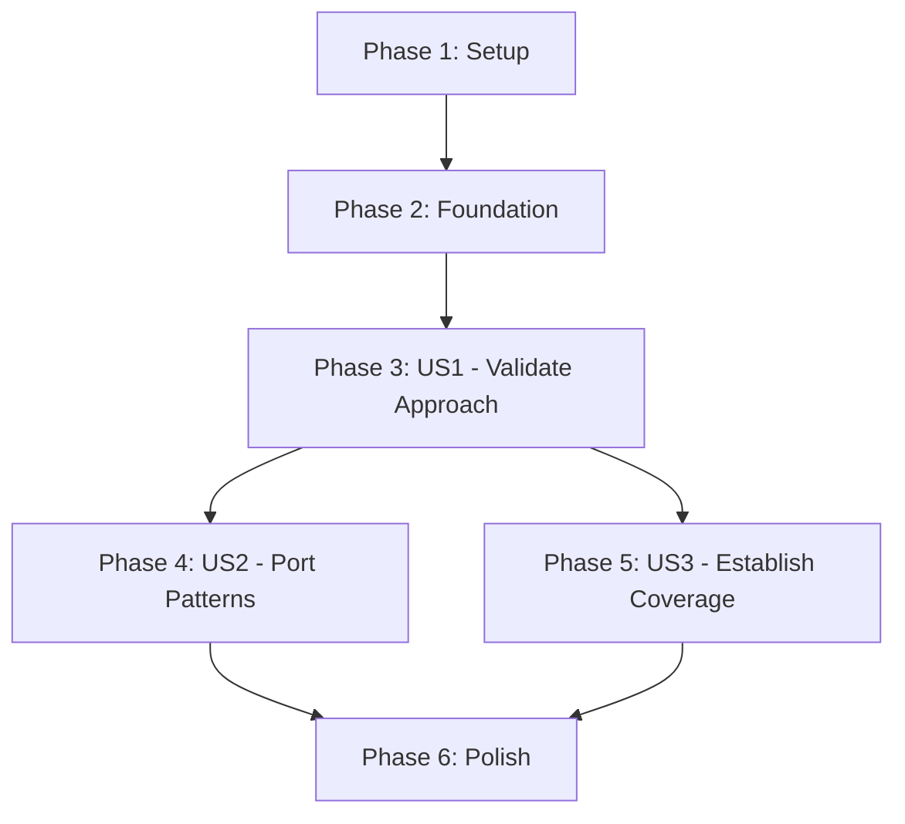

# Tasks: Storybook-First E2E Testing Strategy

**Input**: Design documents from `/specs/002-storybook-e2e-testing/`
**Prerequisites**: plan.md, spec.md, research.md, data-model.md, quickstart.md

**Tests**: This feature IS the testing infrastructure - all tasks create test code

**Organization**: Tasks are grouped by user story to enable independent implementation and testing of each story. Each user story can be implemented and verified independently.

## Format: `[ID] [P?] [Story] Description`
- **[P]**: Can run in parallel (different files, no dependencies)
- **[Story]**: Which user story this task belongs to (e.g., US1, US2, US3)
- Include exact file paths in descriptions

---

## Phase 1: Setup (Shared Infrastructure)

**Purpose**: Configure Playwright for Storybook testing - enables all user stories

- [X] T001 Configure Playwright with Storybook project in playwright.config.js
  - Add `storybook-chromium` project targeting http://localhost:6006
  - Set testMatch pattern: `/tests\/e2e\/storybook\/.*\.spec\.ts/`
  - Do NOT add webServer config (Storybook runs manually per research.md Q1)
- [X] T002 Create test directory structure
  - Create `tests/e2e/storybook/` for component tests
  - Create `tests/e2e/app/` (if doesn't exist) for integration tests
  - Ensure `tests/e2e/helpers/` exists for shared utilities
- [X] T003 [P] Create Storybook helper utilities in tests/e2e/helpers/storybook-helpers.ts
  - Function to build story URL: `getStoryUrl(componentName, storyName)`
  - Function to navigate to story: `gotoStory(page, storyId)`
  - Export story URL pattern constant

---

## Phase 2: Foundational (Blocking Prerequisites)

**Purpose**: Core page objects that MUST work in both contexts before user story testing can begin

**⚠️ CRITICAL**: These page objects must be proven context-agnostic before ANY user story implementation

- [X] T004 Refactor ItemFormPage in tests/e2e/helpers/page-objects.ts
  - Use context-agnostic selectors: `input[name="name"]`, `textarea[name="description"]`, `button[type="submit"]`
  - Remove getByLabel() selectors (Grommet incompatible per research.md Q4)
  - Add JSDoc documenting known Grommet quirks
  - Methods: fillName(), fillDescription(), submit(), expectSuccess()
- [X] T005 [P] Create InventoryPage in tests/e2e/helpers/page-objects.ts
  - Method: clickCreateItem() - finds "Create Item" button
  - Method: expectItemInList(itemName) - verifies item appears in list
  - Context-agnostic selectors only
- [X] T006 [P] Verify existing Storybook stories exist
  - Confirm meteor-app/imports/ui/ItemForm.stories.tsx exists
  - Confirm meteor-app/imports/ui/TouchButton.stories.tsx exists (if applicable)
  - Document story IDs for each component
  - No new stories needed for MVP per plan.md

**Checkpoint**: Page objects are context-agnostic - user story implementation can now begin in parallel

---

## Phase 3: User Story 1 - Validate Component Testing Approach (Priority: P1) 🎯 MVP

**Goal**: Prove that testing components in Storybook isolation works and selectors port to full app

**Independent Test**:
1. Run Storybook tests: `npx playwright test tests/e2e/storybook/ItemForm.spec.ts`
2. Verify 100% pass rate
3. Run full app test: `npx playwright test tests/e2e/app/item-creation.spec.ts`
4. Verify same page object works in both contexts

**Success Criteria**: SC-001 (100% ComponentTest pass rate), SC-003 (90% selector reuse)

### Component Tests for User Story 1

- [X] T007 [P] [US1] Create ItemForm component test in tests/e2e/storybook/ItemForm.spec.ts
  - Test: "should fill and submit form successfully"
    - Navigate to `http://localhost:6006/iframe.html?id=itemform--default&viewMode=story`
    - Use ItemFormPage page object
    - Fill name and description
    - Submit form
    - Verify success (DOM assertion or Storybook action)
  - Test: "should show validation error for empty name"
    - Navigate to story
    - Submit without filling
    - Expect validation error message
  - Test: "should clear form after successful submission"
    - Submit valid form
    - Expect fields cleared

### Integration Tests for User Story 1 (Porting Proven Patterns)

- [X] T008 [US1] Refactor item creation integration test in tests/e2e/app/item-creation.spec.ts
  - Test: "User can create new item from main screen"
    - Navigate to http://localhost:3000
    - Use InventoryPage.clickCreateItem()
    - Use SAME ItemFormPage from T007 (proven in Storybook)
    - Fill form with proven pattern
    - Submit
    - Verify item in list (InventoryPage.expectItemInList())
    - Verify data persistence (query MongoDB or re-navigate)
  - DEPENDENCY: Must verify T007 has 100% pass rate first
  - **COMPLETED**: Full integration test validates UI → Meteor methods → DB → reactive UI

### Validation & Documentation for User Story 1

- [X] T009 [US1] Document TestPattern for form submission
  - Create pattern documentation in tests/e2e/helpers/page-objects.ts JSDoc
  - Pattern name: "Submit Grommet form with name attribute selectors"
  - Document selectors: input[name="name"], textarea[name="description"], button[type="submit"]
  - Document known issue: "Cannot use getByLabel with Grommet FormField"
  - Mark as validatedInStorybook: true, portedToIntegration: true
  - **COMPLETED**: Pattern documented in ItemFormPage JSDoc with full usage example

**Checkpoint**: User Story 1 complete - testing approach PROVEN. Can demonstrate:
- ✅ ComponentTest passes in Storybook isolation
- ✅ Same page object works in full app IntegrationTest
- ✅ TestPattern documented and validated

---

## Phase 4: User Story 2 - Port Proven Test Patterns to Full App (Priority: P2)

**Goal**: Apply validated patterns from US1 to additional critical user workflows in full app

**Independent Test**:
1. Run Storybook tests for new components: `npx playwright test tests/e2e/storybook/`
2. Verify 100% pass rate
3. Port to full app tests: `npx playwright test tests/e2e/app/`
4. Verify same patterns work across all integration tests

**Success Criteria**: SC-002 (50% time reduction), SC-006 (critical paths have both test levels)

**DEPENDENCY**: Requires US1 (T007-T009) complete with 100% pass rate

### Component Tests for User Story 2

- [ ] T010 [P] [US2] Create TouchButton component test in tests/e2e/storybook/TouchButton.spec.ts (if story exists)
  - Test: "should respond to button click"
  - Test: "should show visual feedback on press"
  - Use proven selector patterns from US1
  - Document any new patterns discovered

### Integration Tests for User Story 2

- [ ] T011 [US2] Port proven patterns to tag management tests in tests/e2e/app/tag-management.spec.ts
  - Identify which page objects needed (may require new TagFormPage)
  - Create ComponentTests for tag form in Storybook first
  - Then port to full app using proven patterns
  - Test: "User can create new tag"
  - Test: "User can assign tag to item"
- [ ] T012 [US2] Port proven patterns to touch optimization tests in tests/e2e/app/touch-optimization.spec.ts
  - Refactor existing tests to use proven selector patterns
  - Replace any getByLabel() with name attribute selectors
  - Ensure tests use Playwright auto-waiting (no fixed timeouts)
  - Test: "Long-press context menu" (T053b from existing spec)
  - Test: "Swipe-back navigation" (T053d from existing spec)

### Page Objects for User Story 2

- [ ] T013 [P] [US2] Create additional context-agnostic page objects in tests/e2e/helpers/page-objects.ts
  - TagFormPage (if needed for tag management)
  - LongPressContextMenuPage (if needed for touch tests)
  - Follow proven patterns from ItemFormPage
  - Use name/type/data-testid selectors only

**Checkpoint**: User Story 2 complete - proven patterns applied to multiple workflows. Can demonstrate:
- ✅ Multiple ComponentTests passing in Storybook
- ✅ Multiple IntegrationTests using same page objects
- ✅ Test development time reduced (measured against previous debugging time)

---

## Phase 5: User Story 3 - Establish Component Test Coverage (Priority: P3)

**Goal**: Comprehensive Storybook test coverage for all critical UI components

**Independent Test**:
1. Run full Storybook test suite: `npx playwright test tests/e2e/storybook/`
2. Verify all components have passing tests
3. Intentionally break a component, verify test catches regression

**Success Criteria**: SC-007 (new components have Storybook tests before integration)

**DEPENDENCY**: Requires US1 and US2 complete (patterns established)

### Component Tests for User Story 3

- [ ] T014 [P] [US3] Create comprehensive ItemForm tests in tests/e2e/storybook/ItemForm.spec.ts
  - Test: "should handle special characters in name field"
  - Test: "should enforce max length validation"
  - Test: "should handle container selection"
  - Test: "should upload attachment (if applicable)"
  - Expand beyond MVP to cover all interaction modes
- [ ] T015 [P] [US3] Create LongPressContextMenu component test in tests/e2e/storybook/LongPressContextMenu.spec.ts (if story exists)
  - Test: "should show menu on long press"
  - Test: "should hide menu on outside click"
  - Test: "should execute menu action on selection"
- [ ] T016 [P] [US3] Create additional critical component tests
  - Identify remaining critical components from meteor-app/imports/ui/*.stories.tsx
  - Create ComponentTests for each
  - Follow proven patterns from US1 and US2
  - Document any new patterns discovered

### Process & Documentation for User Story 3

- [ ] T017 [US3] Create test pattern catalog in specs/002-storybook-e2e-testing/test-patterns.md
  - Document all proven TestPatterns
  - For each pattern: selectors used, interaction sequence, assertions, known issues
  - Include examples from ItemFormPage, TouchButton, etc.
  - Reference quickstart.md workflows
- [ ] T018 [US3] Update quickstart.md with additional examples
  - Add examples for newly tested components
  - Document any edge cases discovered during US3
  - Update debugging section with new common issues

**Checkpoint**: User Story 3 complete - comprehensive component coverage established. Can demonstrate:
- ✅ All critical UI components have Storybook tests
- ✅ Component regressions caught immediately
- ✅ New component workflow documented and followed

---

## Phase 6: Polish & Cross-Cutting Concerns

**Purpose**: Improvements that affect multiple user stories and project-wide testing practices

- [ ] T019 [P] Add npm scripts to package.json
  - `test:e2e:storybook` → `npx playwright test tests/e2e/storybook/`
  - `test:e2e:app` → `npx playwright test tests/e2e/app/`
  - `test:e2e:all` → `npx playwright test tests/e2e/`
  - Document in quickstart.md quick reference
- [ ] T020 [P] Update project README.md with testing approach
  - Link to specs/002-storybook-e2e-testing/quickstart.md
  - Explain two-phase testing strategy
  - Document prerequisite: keep Storybook running
- [ ] T021 Validate test performance goals from plan.md
  - Measure ComponentTest execution time (goal: <30s per story)
  - Measure full E2E suite time (goal: <5min)
  - Document actual performance in plan.md
  - Identify optimization opportunities if goals not met
- [ ] T022 [P] Create CI/CD guidance in specs/002-storybook-e2e-testing/ci-cd.md
  - How to run Storybook in CI
  - How to run both test suites in pipeline
  - Recommended workflow: Storybook tests on every commit, full E2E on merge
  - Parallel execution strategies

**Final Checkpoint**: All phases complete - two-phase testing strategy fully implemented

---

## Dependencies Between User Stories

**Critical Path**: Setup → Foundation → US1 (MVP)
**Parallel Opportunities**: After US1, US2 and US3 can proceed in parallel

---

## Parallel Execution Examples

### After Phase 2 (Foundation Complete):

**Parallel Group 1**: US1 Component Tests
- T007 (ItemForm component test) - independent, different files

**Sequential within US1**:
- T007 MUST complete with 100% pass before T008 (integration test)
- T008 MUST complete before T009 (documentation)

### After US1 Complete:

**Parallel Group 2**: US2 and US3 can proceed simultaneously
- T010 (TouchButton component test - US2)
- T014 (Comprehensive ItemForm tests - US3)
- T015 (LongPressContextMenu - US3)

**Parallel Group 3**: Integration tests and documentation
- T011 (Tag management - US2)
- T012 (Touch optimization - US2)
- T017 (Test pattern catalog - US3)

### Final Phase:

**Parallel Group 4**: Polish tasks
- T019 (npm scripts)
- T020 (README updates)
- T022 (CI/CD guidance)

---

## Implementation Strategy

### MVP Scope (Recommended):
**Phase 1 + Phase 2 + Phase 3 (US1 only)**
- Total tasks: T001-T009 (9 tasks)
- Delivers: Proven testing approach with one complete example (ItemForm)
- Validates: SC-001 (100% pass rate), SC-003 (selector portability)
- Timeline: ~2-3 days

**Benefits of MVP-first approach**:
- Quickly proves/disproves the two-phase testing hypothesis
- Provides concrete example for team training
- Enables iteration on patterns before full coverage
- Reduces risk of implementing wrong approach at scale

### Full Implementation:
**All Phases (US1 + US2 + US3 + Polish)**
- Total tasks: T001-T022 (22 tasks)
- Delivers: Complete two-phase testing strategy with comprehensive coverage
- Validates: All success criteria (SC-001 through SC-007)
- Timeline: ~1-2 weeks

---

## Task Summary

**Total Tasks**: 22
- Phase 1 (Setup): 3 tasks
- Phase 2 (Foundation): 3 tasks
- Phase 3 (US1 - MVP): 3 tasks
- Phase 4 (US2): 4 tasks
- Phase 5 (US3): 5 tasks
- Phase 6 (Polish): 4 tasks

**Parallelization Opportunities**: 12 tasks marked [P]

**User Story Breakdown**:
- US1 (Validate Approach): 3 tasks (T007-T009)
- US2 (Port Patterns): 4 tasks (T010-T013)
- US3 (Establish Coverage): 5 tasks (T014-T018)
- Shared infrastructure: 6 tasks (T001-T006)
- Polish: 4 tasks (T019-T022)

**Independent Test Criteria**:
- US1: ComponentTest passes + IntegrationTest uses same page object successfully
- US2: Multiple integration tests refactored with proven patterns, measurable time reduction
- US3: All critical components have Storybook tests, regression caught in test

**Suggested MVP**: Phases 1-3 (T001-T009) → Delivers validated testing approach
**Full Feature**: All phases (T001-T022) → Delivers comprehensive test coverage
