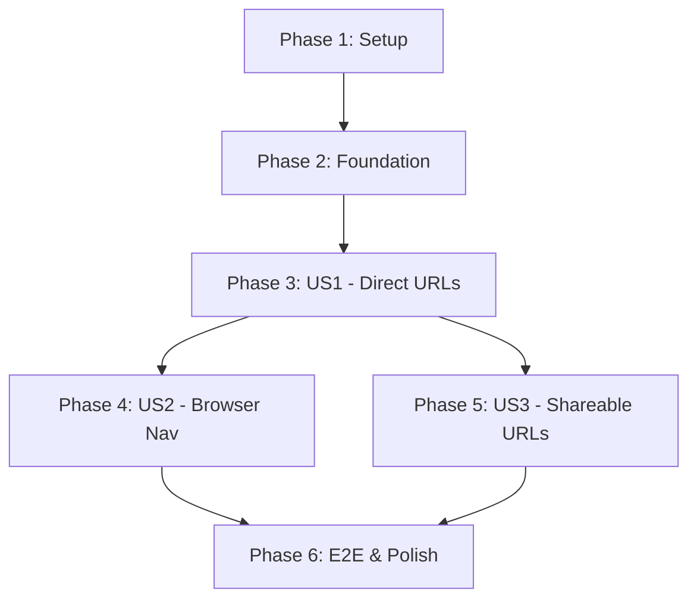

# Tasks: URL Routing for Single-Page Application

**Input**: Design documents from `/specs/003-url-routing/`
**Prerequisites**: plan.md, spec.md, research.md, data-model.md, contracts/routes.yaml, quickstart.md

**Tests**: E2E tests already exist - implementation will make them pass (NOT test-first approach)

**Organization**: Tasks are grouped by user story to enable independent implementation and testing of each story. Each user story can be implemented and verified independently.

## Format: `[ID] [P?] [Story] Description`
- **[P]**: Can run in parallel (different files, no dependencies)
- **[Story]**: Which user story this task belongs to (e.g., US1, US2, US3)
- Include exact file paths in descriptions

---

## Phase 1: Setup (Shared Infrastructure)

**Purpose**: Install Wouter library and prepare routing infrastructure - enables all user stories

- [X] T001 Install Wouter routing library in meteor-app/package.json
  - Run: `cd meteor-app && npm install wouter@^3.0.0`
  - Verify: `npm list wouter` shows v3.x.x
  - Commit package.json and package-lock.json changes
- [X] T002 [P] Create NotFoundView component in meteor-app/imports/ui/NotFoundView.tsx
  - Functional component with TypeScript
  - Display "Page not found" message using Grommet Heading
  - Include Button to navigate back to home (will use Link in Phase 3)
  - Export as named export
- [X] T003 [P] Document routing patterns in meteor-app/imports/ui/README.md (create if needed)
  - Document URL patterns for all 7 routes
  - Document useParams pattern for itemId/tagId
  - Document Link vs setLocation usage
  - Reference quickstart.md for detailed examples

---

## Phase 2: Foundational (Blocking Prerequisites)

**Purpose**: Core routing setup in App.tsx that MUST work before user story features can be added

**⚠️ CRITICAL**: This phase replaces state-based navigation with URL routing - all user stories depend on this

- [X] T004 Replace state-based navigation with Wouter routing in meteor-app/imports/ui/App.tsx
  - Import: `import { Route, Switch } from 'wouter'`
  - Remove: `const [currentView, setCurrentView] = useState<View>('items')`
  - Remove: `const [selectedItemId, setSelectedItemId] = useState<string | undefined>()`
  - Remove: `const [selectedTagId, setSelectedTagId] = useState<string | undefined>()`
  - Preserve: `searchQuery` and `itemsViewFilters` state (not in URL per spec)
  - Replace view switching logic with `<Switch>` containing 7 `<Route>` components
  - Add routes per contracts/routes.yaml:
    - `<Route path="/" component={AllItemsView} />`
    - `<Route path="/items" component={AllItemsView} />`
    - `<Route path="/tags" component={AllTagsView} />`
    - `<Route path="/search" component={SearchResultsView} />`
    - `<Route path="/items/:itemId" component={ItemDetailView} />`
    - `<Route path="/tags/:tagId" component={ItemsByTagView} />`
    - `<Route component={NotFoundView} />` (catchall)
  - Ensure TypeScript compilation passes with no new errors
- [X] T005 Update navigation buttons to use Wouter Link in meteor-app/imports/ui/App.tsx
  - Import: `import { Link, useLocation } from 'wouter'`
  - Wrap Items button with `<Link href="/items">...</Link>`
  - Wrap Tags button with `<Link href="/tags">...</Link>`
  - Wrap Search button with `<Link href="/search">...</Link>`
  - Update `primary` prop logic to use `useLocation()` instead of `currentView`
  - Replace onClick handlers that called `setCurrentView()` (remove them)
  - Follow pattern from quickstart.md Step 3

**Checkpoint**: Foundation complete - URL routing works for navigation buttons, user story features can now be added

---

## Phase 3: User Story 1 - Direct URL Navigation (Priority: P1) 🎯 MVP

**Goal**: Users can navigate directly to views by typing URLs in address bar

**Independent Test**:
1. Start Meteor app: `cd meteor-app && npm start`
2. Navigate to `http://localhost:3000/tags` → Tags view displays
3. Navigate to `http://localhost:3000/items` → Items view displays
4. Navigate to `http://localhost:3000/search` → Search view displays
5. Navigate to `http://localhost:3000/invalid` → NotFoundView displays

**Success Criteria**: SC-001 (direct URL navigation), SC-007 (URL updates <100ms), FR-001 through FR-006

### Implementation for User Story 1

- [X] T006 [US1] Update ItemDetailView to use route parameters in meteor-app/imports/ui/ItemDetailView.tsx
  - Import: `import { useParams } from 'wouter'`
  - Add: `const { itemId } = useParams<{ itemId: string }>()`
  - Replace prop `itemId: string` with route parameter
  - Add validation: Check if itemId exists, show error if undefined
  - Add error handling: If item not found in DB, show "Item not found" with Link to /items
  - Follow pattern from quickstart.md Step 4
- [X] T007 [P] [US1] Update ItemsByTagView to use route parameters in meteor-app/imports/ui/ItemsByTagView.tsx
  - Import: `import { useParams } from 'wouter'`
  - Add: `const { tagId } = useParams<{ tagId: string }>()`
  - Replace prop `tagId: string` with route parameter
  - Add validation: Check if tagId exists, show error if undefined
  - Add error handling: If tag not found in DB, show "Tag not found" with Link to /tags
  - Follow pattern from quickstart.md Step 4
- [X] T008 [US1] Update component signatures in meteor-app/imports/ui/App.tsx
  - Remove `itemId` prop from ItemDetailView (now uses useParams)
  - Remove `tagId` prop from ItemsByTagView (now uses useParams)
  - Verify TypeScript compilation passes
  - Verify all routes render correctly

### Validation for User Story 1

- [ ] T009 [US1] Manual testing of direct URL navigation
  - Test all 7 routes with direct browser navigation
  - Test invalid routes → NotFoundView
  - Test invalid item/tag IDs → Error messages display
  - Test page refresh at each route → Same view displays
  - Document any issues in specs/003-url-routing/plan.md

**Checkpoint**: User Story 1 complete - Direct URL navigation works for all routes

---

## Phase 4: User Story 2 - Browser Navigation Controls (Priority: P2)

**Goal**: Users can use browser back/forward buttons to navigate

**Independent Test**:
1. Start at /items → Click Tags button → URL shows /tags
2. Click browser back button → Returns to /items
3. Click browser forward button → Returns to /tags
4. Verify URL updates in address bar for each navigation
5. Verify view changes match URL

**Success Criteria**: SC-002 (back button 100%), SC-003 (forward button 100%), FR-009, FR-010

### Implementation for User Story 2

- [X] T010 [P] [US2] Update item navigation links to use Wouter Link in meteor-app/imports/ui/AllItemsView.tsx
  - Import: `import { Link } from 'wouter'`
  - Find item click handlers that navigate to item detail
  - Replace onClick with `<Link href={'/items/' + item._id}>...</Link>`
  - Ensure clicking item navigates to /items/:itemId route
  - Verify browser history stack updates correctly
- [X] T011 [P] [US2] Update tag navigation links to use Wouter Link in meteor-app/imports/ui/AllTagsView.tsx
  - Import: `import { Link } from 'wouter'`
  - Find tag click handlers that navigate to items-by-tag view
  - Replace onClick with `<Link href={'/tags/' + tag._id}>...</Link>`
  - Ensure clicking tag navigates to /tags/:tagId route
  - Verify browser history stack updates correctly
- [X] T012 [US2] Update breadcrumb navigation to use Wouter Link in meteor-app/imports/ui/BreadcrumbTrail.tsx (if exists)
  - Import: `import { Link } from 'wouter'`
  - Replace any navigation logic with Link components
  - Ensure breadcrumb clicks update browser history
  - If BreadcrumbTrail doesn't exist, skip this task
  - NOTE: BreadcrumbTrail is for container hierarchy navigation (not in route spec), keeping callback-based

### Validation for User Story 2

- [ ] T013 [US2] Manual testing of browser navigation controls
  - Test back/forward buttons across all routes
  - Test rapid navigation (Items → Tags → Items → Tags)
  - Verify browser history records each navigation
  - Test back/forward with parameterized routes (/items/:itemId)
  - Document any issues in specs/003-url-routing/plan.md

**Checkpoint**: User Story 2 complete - Browser back/forward buttons work correctly

---

## Phase 5: User Story 3 - Shareable and Bookmarkable URLs (Priority: P3)

**Goal**: Users can bookmark and share URLs that navigate directly to specific views

**Independent Test**:
1. Navigate to item detail view (e.g., /items/abc123)
2. Copy URL from address bar
3. Open new browser tab, paste URL
4. Verify same item detail view displays
5. Test bookmark → reopen → same view displays

**Success Criteria**: SC-006 (page refresh <2s), SC-010 (shared URLs work 100%), FR-020

### Implementation for User Story 3

- [ ] T014 [P] [US3] Add programmatic navigation after item creation in meteor-app/imports/ui/ItemForm.tsx
  - Import: `import { useLocation } from 'wouter'`
  - Add: `const [, setLocation] = useLocation()`
  - After successful item creation, call: `setLocation('/items/' + newItemId)`
  - Navigate user to newly created item's detail view
  - Follow pattern from quickstart.md "Navigate after action"
- [ ] T015 [P] [US3] Add programmatic navigation after tag creation in meteor-app/imports/ui/CreateTagDialog.tsx (if exists)
  - Import: `import { useLocation } from 'wouter'`
  - Add: `const [, setLocation] = useLocation()`
  - After successful tag creation, call: `setLocation('/tags/' + newTagId)`
  - Navigate user to items filtered by newly created tag
  - If CreateTagDialog doesn't exist or doesn't navigate, skip this task

### Validation for User Story 3

- [ ] T016 [US3] Manual testing of shareable URLs
  - Create bookmark for each route type (list, detail, search)
  - Test reopening bookmarks → Correct views display
  - Copy URLs and open in incognito window → Correct views display
  - Test page refresh at item detail view → Same item displays
  - Test page refresh at tag filter view → Same tag filter displays
  - Document any issues in specs/003-url-routing/plan.md

**Checkpoint**: User Story 3 complete - URLs are fully bookmarkable and shareable

---

## Phase 6: E2E Test Validation & Polish

**Purpose**: Verify blocked tests now pass and update documentation

**⚠️ CRITICAL**: This phase unblocks T012 from spec 002-storybook-e2e-testing

- [ ] T017 Run E2E tests to verify routing works in tests/e2e/app/tag-management.spec.ts
  - Run: `npm run test:e2e:skip-server:headless -- tests/e2e/app/tag-management.spec.ts --project=chromium`
  - Verify T012 tests pass (currently blocked by missing routing)
  - Verify `tagsPage.goto()` navigates to /tags and shows Tags view
  - Fix any test failures related to routing
  - Document results in specs/003-url-routing/plan.md
- [ ] T018 [P] Run full E2E test suite to verify no regressions in tests/e2e/app/
  - Run: `npm run test:e2e:skip-server:headless -- tests/e2e/app/ --project=chromium`
  - Verify all existing tests still pass
  - Verify page object `goto()` methods work correctly
  - Fix any broken tests (should only require navigation code changes, not assertions)
  - Document any test changes needed in specs/003-url-routing/plan.md
- [ ] T019 [P] Update project README with routing information in README.md
  - Add section "URL Routing" explaining URL patterns
  - Link to specs/003-url-routing/quickstart.md
  - Document all 7 routes with examples
  - Update any outdated state-based navigation documentation
- [ ] T020 [P] Update TypeScript types and remove unused View type in meteor-app/imports/ui/App.tsx
  - Remove: `type View = 'items' | 'tags' | 'itemsByTag' | 'search'`
  - Remove any other unused types related to state-based navigation
  - Verify TypeScript compilation passes with no unused type warnings
  - Run: `cd meteor-app && npm run type-check` (if script exists)
- [ ] T021 Measure and document performance metrics in specs/003-url-routing/plan.md
  - Measure URL update time on navigation (goal: <100ms)
  - Measure page refresh time at item detail view (goal: <2s including data fetch)
  - Measure bundle size increase from Wouter (expect: ~2.1 KB gzipped)
  - Document actual metrics vs goals
  - Note: Use browser DevTools Performance tab or Lighthouse
- [ ] T022 Update spec 002 tasks.md to unblock T012 in specs/002-storybook-e2e-testing/tasks.md
  - Change T012 status from "BLOCKED ⚠️" to unblocked
  - Update T012 description to remove blocking note
  - Add note: "Unblocked by spec 003 routing implementation"
  - Commit updated tasks.md

---

## Dependencies Between User Stories

**Critical Path**: Setup → Foundation → US1 → US2 → Validation
**Parallel Opportunities**: After US1, US2 and US3 can proceed in parallel (different components)

---

## Parallel Execution Examples

### Phase 1 (Setup):

**Parallel Group 1**: Documentation and component creation
- T002 (Create NotFoundView component)
- T003 (Document routing patterns)

**Sequential**: T001 (Install Wouter) MUST complete first

### Phase 3 (User Story 1):

**Parallel Group 2**: Update view components with route parameters
- T006 (ItemDetailView - useParams)
- T007 (ItemsByTagView - useParams)

**Sequential**: T004, T005 (App.tsx routing setup) MUST complete before T006-T008

### Phase 4 (User Story 2):

**Parallel Group 3**: Update navigation links in different components
- T010 (AllItemsView - item links)
- T011 (AllTagsView - tag links)
- T012 (BreadcrumbTrail - breadcrumb links, if exists)

### Phase 5 (User Story 3):

**Parallel Group 4**: Add programmatic navigation after actions
- T014 (ItemForm - navigate to new item)
- T015 (CreateTagDialog - navigate to new tag, if exists)

### Phase 6 (E2E & Polish):

**Parallel Group 5**: Documentation and validation tasks
- T018 (Run E2E test suite)
- T019 (Update README)
- T020 (Clean up TypeScript types)

**Sequential**: T017 (Verify T012 tests) should complete before T022 (Update spec 002 tasks.md)

---

## Implementation Strategy

### MVP Scope (Recommended):
**Phase 1 + Phase 2 + Phase 3 (US1 only)**
- Total tasks: T001-T009 (9 tasks)
- Delivers: Direct URL navigation to all views, NotFoundView for invalid routes
- Validates: SC-001 (direct navigation), FR-001 through FR-014
- Unblocks: T012 integration tests (partial - basic routing works)
- Timeline: ~4-6 hours

**Benefits of MVP-first approach**:
- Proves routing works for E2E tests immediately
- Users can bookmark and share URLs
- Minimal scope reduces risk
- Enables iteration on browser navigation patterns

### Full Implementation:
**All Phases (US1 + US2 + US3 + E2E Validation)**
- Total tasks: T001-T022 (22 tasks)
- Delivers: Complete URL routing with browser controls and shareable links
- Validates: All success criteria (SC-001 through SC-010)
- Unblocks: T012 fully (all integration tests pass)
- Timeline: ~7-11 hours (matches quickstart.md estimate)

---

## Task Summary

**Total Tasks**: 22
- Phase 1 (Setup): 3 tasks
- Phase 2 (Foundation): 2 tasks
- Phase 3 (US1 - Direct URLs): 4 tasks
- Phase 4 (US2 - Browser Nav): 4 tasks
- Phase 5 (US3 - Shareable URLs): 3 tasks
- Phase 6 (E2E & Polish): 6 tasks

**Parallelization Opportunities**: 13 tasks marked [P]

**User Story Breakdown**:
- US1 (Direct URL Navigation): 4 tasks (T006-T009)
- US2 (Browser Navigation): 4 tasks (T010-T013)
- US3 (Shareable URLs): 3 tasks (T014-T016)
- Shared infrastructure: 5 tasks (T001-T005)
- E2E & Polish: 6 tasks (T017-T022)

**Independent Test Criteria**:
- US1: Type URL in address bar → Correct view displays, page refresh works
- US2: Click navigation → URL updates → Back/forward buttons navigate correctly
- US3: Copy URL → Paste in new tab → Same view displays, bookmarks work

**Suggested MVP**: Phases 1-3 (T001-T009) → Delivers direct URL navigation, unblocks T012 tests
**Full Feature**: All phases (T001-T022) → Delivers complete routing with browser controls and validation

---

## Critical Notes

**Unblocks Spec 002 Task T012**: This routing implementation is REQUIRED for T012 "Port CreateTagDialog to full app integration" to pass. Tests written in T012 assume `/tags` route exists and works.

**TypeScript Strict Mode**: All route parameter usage MUST check for undefined (e.g., `if (!itemId) { /* error */ }`). Wouter returns `string | undefined` for params.

**Grommet Integration**: Link components wrap Grommet Button components. Follow pattern: `<Link href="/path"><Button label="..." /></Link>`.

**State Management**: Keep `searchQuery` and `itemsViewFilters` as component state (NOT in URL per spec). Only navigation state moves to URL.

**Performance**: Wouter adds only ~2.1 KB gzipped. URL updates are synchronous (<100ms). Verify with browser DevTools.

**Error Handling**: Invalid item/tag IDs should show error messages with Link back to list views. Use Grommet Layer/Heading/Button for error UI.

**Testing**: E2E tests in `tests/e2e/app/` already expect routing. Implementation makes them pass without changing test assertions.
