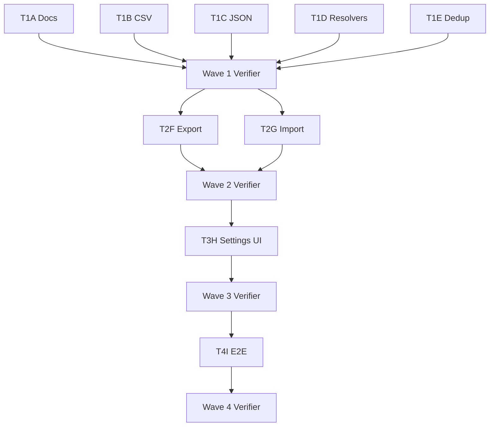

# Tasks: Inventory Import & Export

**Input**: Design documents from `/specs/004-import-export/`
**Prerequisites**: [spec.md](./spec.md), [plan.md](./plan.md), [data-model.md](./data-model.md), [contracts/csv-schema.md](./contracts/csv-schema.md), [contracts/json-schema.md](./contracts/json-schema.md), [quickstart.md](./quickstart.md)

**Source of truth**: This file mirrors the wave-organized task list in the workspace [Spec note](intent://local/note/spec). The task notes themselves carry the detailed Definition of Done; this file is the human-readable index.

**Organization**: Tasks are grouped by **wave**. Each wave ends with a Verifier agent before the next starts. Tasks within a wave run in parallel where possible (marked `[P]`).

## Format: `[ID] [P?] Description`
- **[P]**: Can run in parallel (different files, no dependencies on other tasks in the same wave)
- **[Task note]**: Linked task note ID — implementor agents read these for full scope and DoD

---

## Wave 1 — Pure modules + docs scaffold (5 parallel tasks)

**Purpose**: Build the parser/serializer, sentinel helpers, path resolvers, and dedup classifier as pure, independently-testable modules. None of these touch the UI or Meteor methods.

- [ ] **T1A** Spec Kit docs scaffold under `specs/004-import-export/` — [task note](intent://local/task/1c5c94cf-e7f7-4fc3-ac27-75c8d83ea0d0)
  - Creates: this file plus the six companion docs (`spec.md`, `plan.md`, `data-model.md`, `contracts/csv-schema.md`, `contracts/json-schema.md`, `quickstart.md`)
  - Creates fixture: `fixtures/under-my-roof-sample.csv` (135 rows)
- [ ] **T1B** [P] CSV reader/writer module — [task note](intent://local/task/d1f70e81-5764-4ebf-962f-14c4548f58bc)
  - New: `meteor-app/imports/model/importExport/csv.ts` + `.test.ts`
  - New: `meteor-app/imports/model/importExport/sentinels.ts` + `.test.ts`
  - Adds dependency: `papaparse` + `@types/papaparse` via `cd meteor-app && npm install`
  - Honors [csv-schema.md](./contracts/csv-schema.md) for column order, sentinels, type parsing
- [ ] **T1C** [P] Native JSON serializer/parser module — [task note](intent://local/task/7b5bceeb-53af-477d-b7a9-73a4e7204fb1)
  - New: `meteor-app/imports/model/importExport/json.ts` + `.test.ts`
  - Honors [json-schema.md](./contracts/json-schema.md) for envelope shape and version policy
  - **Critical**: `createdAt` / `modifiedAt` round-trip byte-faithfully (enables JSON re-import no-op)
- [ ] **T1D** [P] Tag and container path resolvers — [task note](intent://local/task/71dcd6e3-7d5c-4ef0-a819-ff9647a3490c)
  - New: `meteor-app/imports/api/importExport/pathResolvers.ts` + `.test.ts`
  - Server-side only (uses Meteor collections); honors [data-model.md § "Tag-Group Convention"](./data-model.md) and [§ "Container-Path Convention"](./data-model.md)
- [ ] **T1E** [P] Dedup / conflict comparator — [task note](intent://local/task/c561daa7-87a7-44ae-943e-ed31ba630369)
  - New: `meteor-app/imports/model/importExport/dedup.ts` + `.test.ts`
  - Honors [data-model.md § "Dedup / Conflict Classification"](./data-model.md)
  - Truth-table tests for `exact-duplicate` / `superset-merge` / `create-new`

**Checkpoint**: Verifier agent runs `cd meteor-app && npm test && npm run check:type && npm run check:code-style` and confirms ≥ 90% line coverage on each new pure module.

---

## Wave 2 — Server methods (2 parallel tasks)

**Purpose**: Wire the Wave 1 modules into Meteor methods with a dry-run mode for import. After this wave, the feature works via `Meteor.callAsync` from a developer console.

- [ ] **T2F** [P] Server export methods — [task note](intent://local/task/90ca66d7-0b9a-4d63-91c0-b002d2276817)
  - New: `meteor-app/imports/api/importExport/export.ts` + `.test.ts`
  - Methods: `inventory.export.json()`, `inventory.export.csv({ umrCompat? })`
  - Pulls full inventory + tags from collections, hands to `serializeJson` / `stringifyCsv`
- [ ] **T2G** [P] Server import methods + dry-run — [task note](intent://local/task/f29aab96-f19c-438e-a9ef-1893c6897a67)
  - New: `meteor-app/imports/api/importExport/import.ts` + `.test.ts`
  - Methods: `inventory.import.json(payload, { dryRun })`, `inventory.import.csv(payload, { dryRun, umrCompat? })`
  - Returns `ImportReport` with counts, warnings, errors, info, samplePreview
  - Includes UMR sample import test (≥ 130 rows created, ≥ 10 categories)
  - Includes JSON round-trip no-op test (re-import → 100% exact-duplicates, 0 writes)
  - Includes JSON timestamp preservation test (`createdAt` survives round-trip exactly)

**Checkpoint**: Verifier agent runs the unit tests for both modules and the full Meteor test suite, confirms type + lint clean, confirms dry-run never writes.

---

## Wave 3 — Settings page UI (1 task)

- [ ] **T3H** Settings page UI at `/settings/data` — [task note](intent://local/task/8910b4f9-71de-4fa5-806d-bff2de34df39)
  - New: `meteor-app/imports/ui/SettingsDataView.tsx`
  - New: `meteor-app/imports/ui/SettingsDataView.stories.tsx` (loading, idle, dry-run preview, success, error)
  - Modify: `meteor-app/imports/ui/App.tsx` (add Wouter `<Route path="/settings/data">` — see [`specs/003-url-routing/quickstart.md`](../003-url-routing/quickstart.md))
  - Export buttons trigger Meteor calls + `Blob` + `<a download>` (filename `inventory-YYYYMMDD.{json,csv}`)
  - Import card: file picker → format detected by extension → "Preview" (dry-run) → preview panel → "Import N items" (real)
  - Touch targets ≥ 44×44px per spec 001

**Checkpoint**: Verifier agent runs `npm run test:e2e:storybook` (root) for the new stories and confirms type + lint clean.

---

## Wave 4 — End-to-end test (1 task)

- [ ] **T4I** Round-trip + UMR-import E2E test — [task note](intent://local/task/86ad5ace-da65-4f2d-a740-818884b18d38)
  - New: `tests/e2e/import-export.spec.js`
  - Test 1 (round-trip): seed items via UI → download JSON → clear DB → re-import → assert item count + spot-check names
  - Test 2 (UMR): upload `specs/004-import-export/fixtures/under-my-roof-sample.csv` → assert preview counts → confirm → assert specific items present (Sony a7R3 + serial, 2020 Model X + VIN, Apple TV under Apple products collection)
  - Single-worker mode (app E2E not parallel-safe per repo AGENTS rules)

**Checkpoint**: Verifier agent runs both E2E tests three times consecutively, confirms zero flakes.

---

## Dependencies Between Waves



**Critical path**: Wave 1 → Wave 2 → Wave 3 → Wave 4 (sequential between waves; parallel within Wave 1 and Wave 2).

---

## Independent Test Criteria (per Wave)

- **Wave 1**: each pure module has unit tests in the same directory and `cd meteor-app && npm test` is green
- **Wave 2**: `inventory.export.json()` returns a string that round-trips through `parseJson`; `inventory.import.csv(sample, { dryRun: true })` returns counts that match the fixture (≥ 130 toCreate on first run)
- **Wave 3**: `/settings/data` loads, file picker accepts `.json` / `.csv`, downloads produce well-formed files
- **Wave 4**: round-trip test + UMR import test both pass three times in a row

---

## Task Summary

**Total tasks**: 9 (across 4 waves)
- Wave 1 (Pure modules + docs): 5 tasks (T1A-T1E), 4 marked [P]
- Wave 2 (Server methods): 2 tasks (T2F, T2G), both [P]
- Wave 3 (Settings UI): 1 task (T3H)
- Wave 4 (E2E test): 1 task (T4I)

**Parallelization**: Wave 1 fans out 5 ways, Wave 2 fans out 2 ways. Waves 3 and 4 are single-task.

**Verification commands** (consolidated from individual task notes):

```bash
# Per-module unit tests (Wave 1, 2)
cd meteor-app && npm test
cd meteor-app && npm run check:type
cd meteor-app && npm run check:code-style

# Storybook component tests (Wave 3)
npm run test:e2e:storybook

# App-level E2E (Wave 4)
npm run test:e2e:app -- import-export.spec.js
```

See [quickstart.md](./quickstart.md) for the developer-facing usage walkthrough.

---

## Cross-References

- [spec.md](./spec.md) — User Stories P1–P4, FRs, success criteria
- [plan.md](./plan.md) — module API surface, structure decisions
- [data-model.md](./data-model.md) — field-by-field UMR mapping, dedup truth table
- [contracts/csv-schema.md](./contracts/csv-schema.md) — column order, sentinel rules, type parsing
- [contracts/json-schema.md](./contracts/json-schema.md) — envelope shape, version policy
- [quickstart.md](./quickstart.md) — UI flow + Meteor method invocation examples
- [Workspace Spec](intent://local/note/spec) — source of truth for wave order and assumptions

